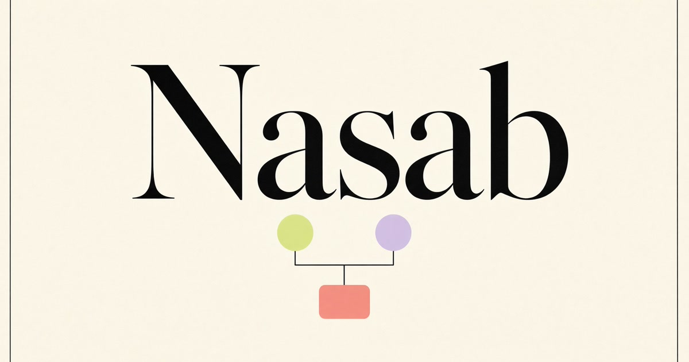

# Nasab

Nasab is a local-first visual studio for building and preserving family trees. Arrange people on an open canvas, connect family relationships, add photos and notes, annotate freely, then export or save the tree to an account.



## Highlights

- Visual family-tree canvas with automatic layout, drag, pan, and zoom.
- Parents, spouses, children, siblings, unions, and readable lineage chains.
- Custom person cards with photos, icons, colors, dates, places, and notes.
- Freehand drawing and resizable text annotations.
- Local-first storage; sign-in is only needed for cross-device cloud copies.
- Google and email/password authentication through Better Auth.
- JSON and image export, responsive mobile UI, and light/dark themes.

## Stack

React 19, TanStack Start/Router/Query, TypeScript, Tailwind CSS v4, React Flow, Better Auth, PostgreSQL/Neon, Nitro, and Vercel.

## Local development

```bash
npm ci
npm run dev
```

The app includes a sample Al-Falah tree and can be used without an account. Production secrets are never committed; see [Production deployment](docs/PRODUCTION_DEPLOYMENT.md).

## Quality gates

```bash
npm run typecheck
npm test
npm run build
```

## Release

Releases follow semantic version tags. See [RELEASE.md](RELEASE.md) for the complete release and rollback checklist.

## License

[MIT](LICENSE) © 2026 Saddad Nabil.
